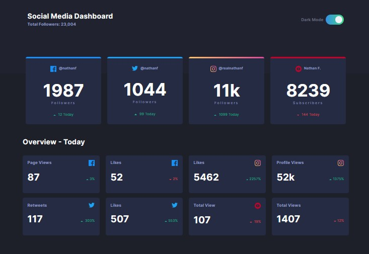

## Welcome! 👋

Thanks for checking out this front-end coding challenge.

### The challenge

Users should be able to:

- View the optimal layout for the site depending on their device's screen size
- See hover states for all interactive elements on the page
- Toggle color theme to their preference

### Screenshot

- Online Link - [Social media dashboed](https://na-r-84.github.io/social-media-dashboard-with-theme/)

## My process

### Built with

- Semantic HTML5 markup
- CSS custom properties
- Flexbox
- CSS Grid
- Scss
-Javascript

## Author

- Website - [Nasim Roshan](https://portfolion.nasiiimdev.se/)
- Linkedin - [Nasim Roshan](www.linkedin.com/in/nasim-roshan-1637a056)

